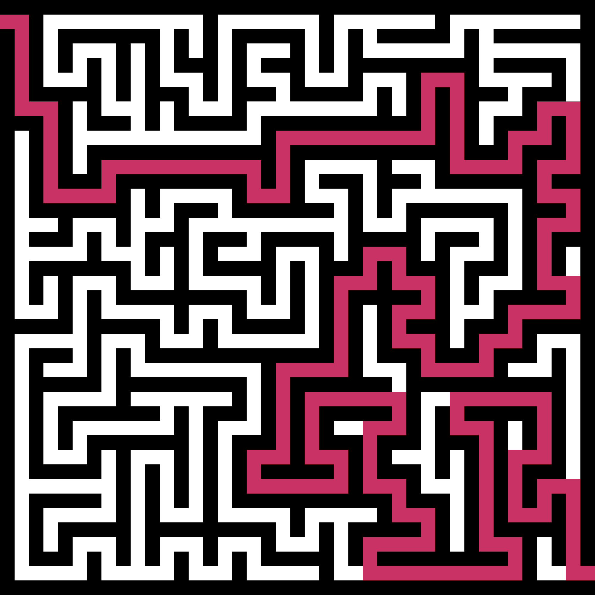

# dfs-maze-generator
In contrast to randomised versions of Kruskal's and Prim's algorithms, a randomised depth-first search generates a maze with an appropriate number of dead ends. It is this which makes these mazes appear as though they could have been designed by hand. In addition to generation, this script will show a maze's solution by backtracking from finish to start without the need for an additional search. **Here is an example output:**

